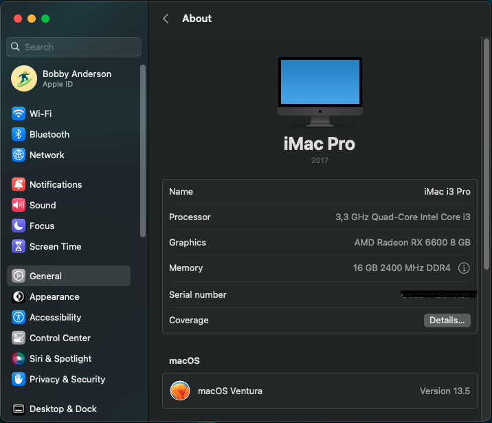

## OpenCore & macOS
| Bootloader     | macOS             |
|----------------|-------------------|
| OpenCore 0.9.3 | Ventura 13.5      |

## Specification
| Name           | Detail                        |
|----------------|-------------------------------|
| Motherboard    | GigaByte H610M H V2 DDR4      |
| Processor      | Intel Core i3 12100F          |
| VGA Card       | XFX AMD Radeon RX 6600        |
| Memory RAM     | 16 GB ( 2x8GB 3200 MHz DDR4 ) |
| Storage        | SSD SATA 2.5 RX7 256GB        |
| WiFi/Bluetooth | Broadcom BCM94360CS2          |

## Credits
- https://github.com/byakkili/Hackintosh-H610M-12400-RX460

## PoC

